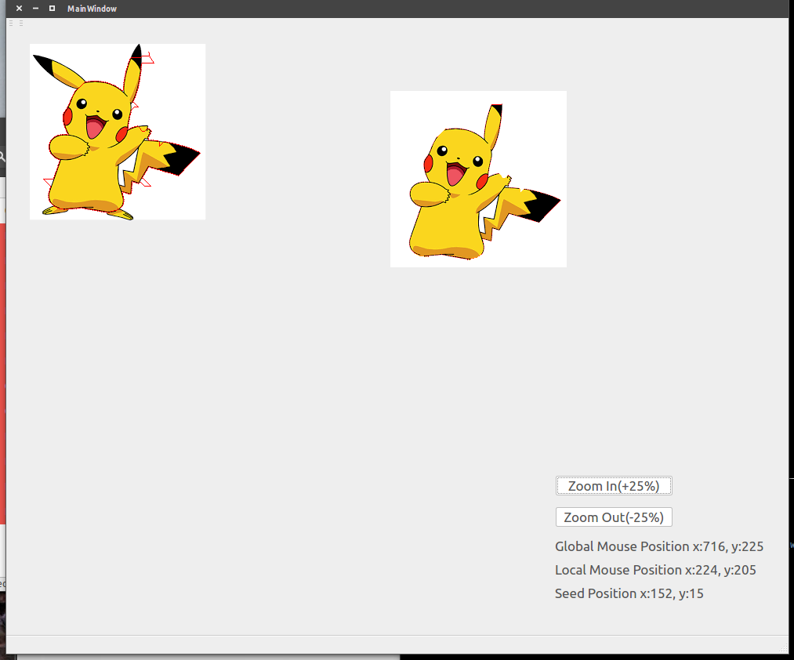

## Intelligent Image Scissor for COMP5421 CV Pro1
### Requirement
> Qt5, OpenCV3, Ubuntu
```
sudo apt install qt5-default libopencv3
```
### Installation && Run gui
```
cd image_scissor
qmake image_scissor.pro
make -j
./image_scissor
```
### Usage
1. Open an image: Ctrl+F
> 
2. Set a seed: Ctrl+Space & Left Click
3. Move your mouse to edit the contour
4. Save the mask: Ctrl+Shift+S
> 
### Debug Mode
1. You can click the above menu to see the cost Pixel Node, Cost Graph, Minimum Path Tree
> For example: Cost Graph \
> 
### Demo Video
[](https://youtu.be/tsduQ8QRWf8)
### TODO List
1. Implement other features on GUI
> * Help menu and about window
> * Grids at image Viewer
2. Algorithm
> * Generate Path on Minimum Path Tree
### Some Bugs I made at this project
1. Usage of priority_queue in STL
> * This kind of container does't provide a **erase** and **update** operation. 
> * The other problem is that we can only chage the state of each node in priority_queue but **can not change the date value(related to priority)**, otherwise it will destory the order the queue(the order won't change). 
> * So you need to use other struction(like vector or array to record the current state of each node), and then add them into queue.
> * The solution I found is like this: 
>> - ``` std::priority_queue<Node::Ptr, std::vector<Node::Ptr>, ValueComp> pqueue; ``` 
>> - ``` std::vector<vector<Node::Ptr> > _node_graph; ```
>> - ``` Node::Ptr p = _pqueue.top(); ``` 
>> - ``` if (p->_state == EXPANDEND) continue; // to discard useless node ``` 
>> - ``` p->_state = EXPANDEND; // the state of all p in queue are changed, meaning that they will be discarded ```
>> - ``` ii, jj \\ the position of extended point r ``` 
>> - ``` r = _node_graph[ii][jj] ```
>> - ``` r->_total_cost = min(r->_total_cost, p->_total_cost + c_pr); // is changed ``` 
>> - ``` pqueue.push(r) // push new node```
2. Usage of floodfill algorithm
> * My unstanding: after setting a seed, just go around, until meet a mountain(the difference of pixel is larger than threshold)

